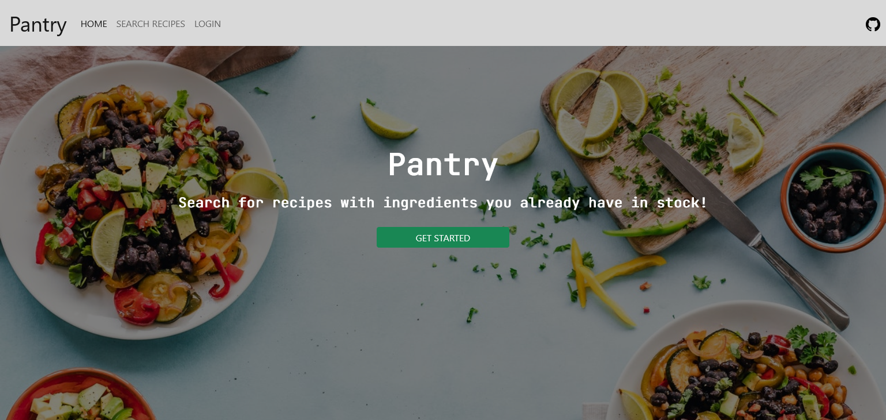

# Pantry
  

  ## Description
  
 Have you ever wanted to make dinner but can't think of anything. This application will take what you have in your pantry and suggest appropriate recipes using the ingredients you already have. Create an account and you can save your favorites for future viewing. Keyword buttons will help you quickly reach an easy meal to make and visual recipe cards will show you how good home cooking can look.

  ## Table of Contents
  
  1) [Description](#description)
  2) [Installation](#installation)
  3) [Usage](#usage)
  4) [Video](#video)
  5) [Collaboration](#collaboration)
  6) [Tests](#tests)
  7) [Questions?](#questions?)
  8) [GitHub](#gitHub)
  9) [License](#license)

  ## Installation
  
 - `git clone ` application to your local machine.
  - `npm init -y`
  - `npm i `
  - `mysql -u root -p`
  - `source db/schema.sql`
  - `quit`
  - `npm start`
  Can also be found on heroku @ ____

  ## Usage
  
  A full stack application utilizing sql practices of Get/Post to find recipes from a database. They can be viewed or even saved with an account.

  ## Video
  
 Here are some images:

  ## Collaboration
  
  For now, just follow the [Contributor Covenant](https://www.contributor-covenant.org/)

  ## Tests
  
  none yet

  ## Questions?
  
  Please contact us at
  - Zachary Clark [GitHub](https://github.com/zaclark369)
  - Diego Marrs [GitHub](https://github.com/StaticCloud)
  - Katie Churchwell [GitHub](https://github.com/katiechurchwell)
  
  ## Credits
  
  Database Code
  Micah Cochran [GitHub](https://github.com/micahcochran/json-cookbook/blob/main/cookbook-100.json)
  
